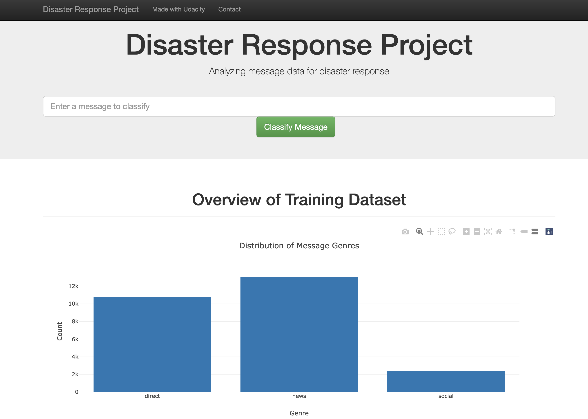
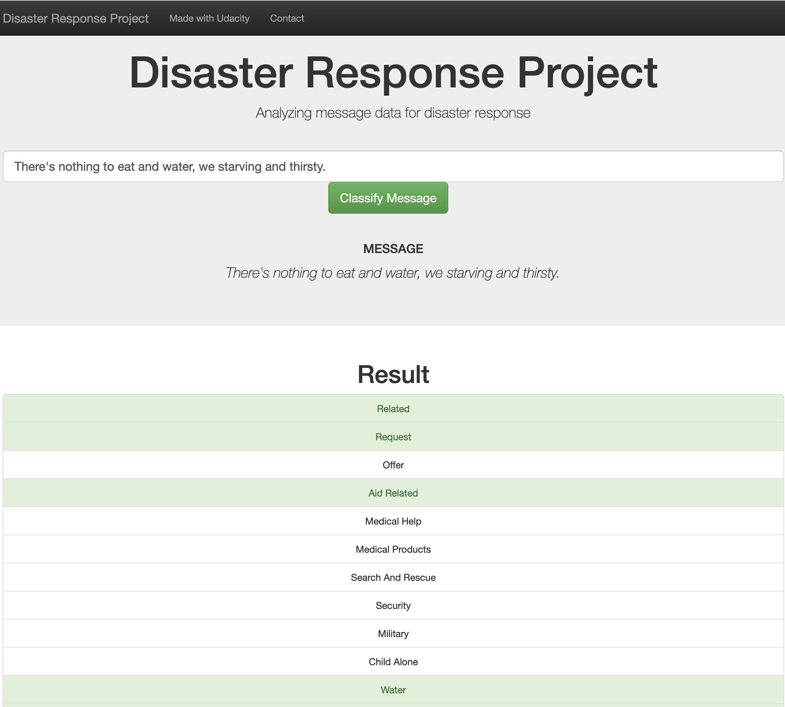

# Disaster Response Pipeline 

## Project Summary
This is a Udacity Data Scientist Nanodegree project. The aim of this project is to create an ETL(Extract, Transform, Load) pipeline, an ML(Machine Learning) pipeline and a Web Application using Disaster Response Dataset provided by [Appen](https://appen.com/) (formally Figure 8). You can find detailed description of each component below. The dataset contains real messages that were sent during disaster events. We are creating a Machine Learning pipeline to classify these events so that we can send the messages to an appropriate disaster relief agency. Let's see files description.
    
## Files Description
#### 1. data\process_data.py (ETL Pipeline)
    -  Loads the messages and categories datasets
    -  Merges the two datasets
    -  Cleans the data 
    -  Stores it in a SQLite database
     
#### 2. models\train_classifier.py (ML Pipeline)
    - Loads data from the SQLite database
    - Splits the dataset into training and test sets
    - Builds a text processing and machine learning pipeline
    - Trains and tunes a model using GridSearchCV
    - Outputs results on the test set
    - Exports the final model as a pickle file
    
#### 3. Web Application
    - The Flask application displays visualizations based on data we extract from SQLite database. 
    - The web app can also classify a disaster event message into the output categories. 

See screenshots for reference. 
##### Disaster Response Data Visualization
  

##### Disaster Response Event Message Classification
   
    
## Project Structure
~~~~~~~
        disaster-response-pipeline
          |-- app
                |-- templates
                        |-- go.html
                        |-- master.html
                |-- run.py
          |-- data
                |-- disaster_message.csv
                |-- disaster_categories.csv
                |-- DisasterResponse.db
                |-- process_data.py
          |-- models
                |-- classifier.pkl
                |-- train_classifier.py
          |-- .gitignore 
          |-- README.md
          |-- requirements.txt
~~~~~~~
## Create a python environment, or a conda environment to run the application.
 - Python Environment
    - Install Python 3.6.x version 
    - open command prompt and run following command to install required python dependencies
    ``` 
        pip install -r requirements.txt
    ``` 
 - Anaconda Environment
    - If you have anaconda installed on your machine, follow the steps to create conda environment
    ```
        conda create --name text_classification_env pip python=3.6.4 anaconda
        conda activate text_classification_env
        pip install -r requirements.txt
    ```
     
## How to run the python scripts and Web App.
### Instructions:
1. Run the following commands in the project's root directory to set up your database and model.

   - To run ETL pipeline that cleans data and stores in database
      - `python data/process_data.py data/disaster_messages.csv data/disaster_categories.csv data/DisasterResponse.db`
   
   - To run ML pipeline that trains classifier and saves
      -  `python models/train_classifier.py data/DisasterResponse.db models/classifier.pkl`

2. Go to `app` directory: `cd app`

3. Run your web app: `python run.py`

## Acknowledgements
Thanks to Udacity as this project is completed as a part of [Udacity Data Scientist Nanodegree](https://www.udacity.com/course/data-scientist-nanodegree--nd025).